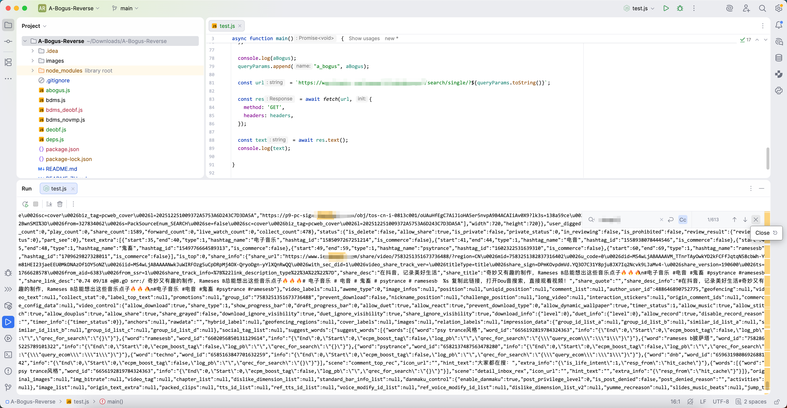

### 0) 介绍

`bdms.js` 是一个爬虫防御工具，它本身受虚拟化技术保护（VMP）。它主要职责是生成`a_bogus`参数，并自动插入到HTTP请求当中。 在这篇文章中，我将会展示如何去除VM保护，并且像原生JS代码一样的在Chrome中调试它。
总体上看，`bdms.js`是一个栈式虚拟机，函数`d`是它的主循环函数，不断的取码-执行。

### 1) 去除混淆
通常情况下，主循环函数包含一个循环和一个`switch`语句，用于取出`opcode`并找到对应的handler执行它。但是这里有一个控制流混淆，它把`switch`语句替换成了很多`if-else`语句。为了分析handlers的功能，我们需要可读性较高的代码，所以要找到一种还原回`switch`结构的方法。不过，`if-else`所使用的谓词都比较简单，均可以在静态分析阶段被确定下来，所以我们能很容的将其恢复为`switch-case`语句。我在`deobf.js`中实现了这个功能。

```bash
node deobf.js "d" "t" bdms.js bdms_out.js
```

第一个参数是主循环函数名，第二个参数为谓词参数名，第三和第四个参数分别为输入文件和输出文件。

```js
// Before
function d() {  
  for (; ; ) {  
    var t = o[a++];  
    if (t < 38)  
      if (t < 19)  
        if (t < 9)  
          if (t < 4)  
            if (t < 2)  
              if (0 === t) {  
                var r = o[a++];  
                p -= r;  
                var e = v.slice(p + 1, p + r + 1)  
                  , n = v[p--]  
                  , d = v[p--];  
                if ("function" != typeof n)  
                  return f = 3,  
                    void (l = new TypeError(typeof n + " is not a function"));  
                var y = V.get(n);  
                if (y)  
                  h.push([o, i, u, s, c, a, f, l]),  
                    g(y[0], d, e, y[1]);  
                else {  
                  var m = n.apply(d, e);  
                  v[++p] = m  
                }  
              } else {  
                var w = v[p--];  
                v[p] = v[p] <= w  
              }
              ....
```

```js
// After
function d() {  
  for (;;) {  
    var t = o[a++];  
    switch (t) {  
      case 0:  
        {  
          var r = o[a++];  
          p -= r;  
          var e = v.slice(p + 1, p + r + 1),  
            n = v[p--],  
            d = v[p--];  
          if ("function" != typeof n) return f = 3, void (l = new TypeError(typeof n + " is not a function"));  
          var y = V.get(n);  
          if (y) h.push([o, i, u, s, c, a, f, l]), g(y[0], d, e, y[1]);else {  
            var m = n.apply(d, e);  
            v[++p] = m;  
          }  
        }  
        break;  
      case 1:  
        {  
          var w = v[p--];  
          v[p] = v[p] <= w;  
        }  
        break;  
      case 2:  
        w = v[p--], v[p] = v[p] > w;  
        break;  
      case 3:  
        {  
          var x = o[a++],  
            S = v[p--],  
            P = [];  
          for (var j in S) P.push(j);  
          s[x] = [P, S];  
        }  
        break;  
      case 4:
```

在解除混淆后，我们可以清晰的看到opcode和handler的对应关系。

### 2) VM的基础功能
通过对handlers的分析，我们可以找出变量和函数的意义和作用。

| Var | New Name        | Desc                                                 |
| --- | --------------- |------------------------------------------------------|
| o   | code            | 字节码流                                                 |
| i   | hasVArgs        | 函数是否使用 vargs (arguments).                            |
| u   | exceptionScopes | 对于异常块的描述 (try/catch/finalizer).                      |
| s   | memory          | 虚拟内存. \[0\] 是它的父函数, \[1\] 是vargs. \[2\] 是第一个参数，以此类推. |
| c   | ins             | this 变量.                                             |
| a   | ip              | 指令指针                                                 |
| f   | interType       | 中断类型. (返回, 抛出异常, 异常中跳转)                              |
| l   | interValue      | 中断值. (一个值或一个地址)                                      |
| p   | sp              | 栈指针                                                  |
| v   | stack           | 运行栈                                                  |
| h   | callStack       | 调用栈                                                  |
| V   | vmFunctionTable | 保存了运行时注册的VM函数，用于call指令中确定函数调用方式.                     |

| Fn  | New Name              | Desc                           |
| --- | --------------------- |--------------------------------|
| J   | CallVMFunctionByIndex | 调用一个VM函数，如果是首次，则需要解密字节码流和字符串表. |
| D   | SetVMFunction         | 注册VM函数.                        |
| X   | CallVMFunction        | 调用VM函数.                        |
| d   | FetchAndExecute       | 取码-执行主循环函数.                    |
| y   | HandleInterruption    | 处理中断.                          |
### 3) 操作码(Opcode)分类

操作码大致分为5种。
#### a) 控制流操作 
更改控制流，修改IP变量值
例如 Call(0) / JMP(53)
有一些特殊的控制流指令，会在特定分支上保持运行栈的状态，比如 17 和 23.

#### b) 算数 / 位操作 / 比较指令
从运行栈中弹出两个或一个操作数，用于二元和一元操作，然后将结果压入栈中。

e.g. push(pop() + pop())

#### c) 对象操作
从Object.property获取值，或者将一个值保存到Object.property中，通常来讲包含2个或3个操作数，object，property和value。有一些特殊操作码直接访问`globalThis`。

e.g. pop()\[pop()\] = pop(), push(pop()\[pop()\]), push(pop()\[pop()\]++)

#### d) 栈操作
压入、复制、弹出等操作。 例如：push(this), push(null), push(imm).

#### e) 其他操作
for-in循环操作，mem访问操作等。

### 4) 编写反编译器
有了以上信息，我们可以为此VM编写一个反编译器，将所有的指令翻译为IR指令，并且构建控制流（CFG）。我此前写过一个框架专门处理此事，它提供了兼容ES5的IR指令，CFG结构对象如基本块和函数，还包含优化管线以及分析Pass等。

这是它大致的工作流程：
- 扫描所有的字节码，处理每个opcode，将其发射为正确的IR指令，插入到基本块中，并在处理控制流操作的时候，构建控制流图。
- 构建SSA（静态单复制）IR，并提升一些虚拟机存器到内存中，用于后续优化。
- 执行优化管线，如`稀疏条件拷贝传播`，`死代码消除`等等。
- 解构SSA IR，并为虚拟机存起分配变量。
- 生成高可读的JS代码。

这里是一个结果展示：
CFG


生成的源代码:
```js
function fn_310(a_0, a_1) {  
  // BB: 0  
  var v_0, v_1, v_2, v_3, v_4;  
  v_0 = a_1.method;  
  v_1 = a_0.iterator[v_0];  
  if (v_1 === m_30) {  
    // BB: 29  
    a_1.delegate = null;  
    v_1 = 'throw' === v_0 && a_0.iterator.return;  
    if (v_1) {  
      // BB: 54  
      a_1.method = 'return';  
      a_1.arg = m_30;  
      m_24(a_0, a_1)  
      v_4 = 'throw' === a_1.method;  
    } else {  
      // BB: 52_to_94_split2  
      v_4 = v_1;  
    }  
    // BB: 94  
    if (!v_4) // BB: 96  
      if ('return' !== v_0) {  
        // BB: 104  
        a_1.method = 'throw';  
        a_1.arg = new TypeError("The iterator does not provide a '" + v_0 + "' method");  
      }  
    // BB: 132  
    return m_29;  
  }  
  // BB: 137  
  v_2 = m_13(v_1, a_0.iterator, a_1.arg);  
  if (!('throw' === v_2.type)) {  
    // BB: 202  
    v_1 = v_2.arg;  
    if (v_1) {  
      // BB: 215  
      if (v_1.done) {  
        // BB: 222  
        a_1[a_0.resultName] = v_1.value;  
        a_1.next = a_0.nextLoc;  
        if ('return' !== a_1.method) {  
          // BB: 259  
          a_1.method = 'next';  
          a_1.arg = m_30;  
        }  
        // BB: 277  
        a_1.delegate = null;  
        v_4 = m_29;  
      } else {  
        // BB: 291  
        v_4 = v_1;  
      }  
      // BB: 294  
      v_3 = v_4;  
    } else {  
      // BB: 296  
      a_1.method = 'throw';  
      a_1.arg = new TypeError('iterator result is not an object');  
      a_1.delegate = null;  
      v_3 = m_29;  
    }  
    // BB: 329  
    return v_3;  
  }  
  // BB: 169  
  a_1.method = 'throw';  
  a_1.arg = v_2.arg;  
  a_1.delegate = null;  
  return m_29;  
}
```

### 5) 调试
现在我们有了另外一个去掉了VM保护的`bdms.js`，我将其命名为`bdms_novmp.js`，我们可以在Chrome中替换指定文件，在DevTool → Sources → Overrides中开启它。

在`bdms.js`中搜索字符串`a_bogus`，我们在19340行发现如下代码：
```js
if (!v_3.searchParams.has('a_bogus')) {
  pr()
  v_3.searchParams.append('a_bogus', m_853(v_3.searchParams.toString(), body))
}
```

查看 `m_853`.
```js
m_853 = function fn_103(a_0, a_1, a_2) {  
  // BB: 0  
  var v_0, v_1, v_2;  
  lr()  
  v_0 = typeof a_1 !== 'string';  
  if (v_0) {  
    // BB: 0_to_57_split1  
    v_1 = v_0;  
  } else {  
    // BB: 38  
    if (a_2) {  
      // BB: 43  
      v_1 = a_2.indexOf('multipart/form-data') != -1;  
    } else {  
      // BB: 38_to_57_split2  
      v_1 = a_2;  
    }  
  }  
  // BB: 57  
  v_0 = navigator.userAgent;  
  v_2 = v_0.indexOf('baiduboxapp') >= 0 ? v_0.replace(new RegExp('\\s(EasyBrowser)?[Ww]ebCore=0x[a-z0-9]{9}$'), '') : v_0;  
  jr(performance.now() - performance.now())  
  return cr(1, 0, 8, a_0, v_1 ? '' : a_1, v_2.indexOf('AlipayClient') >= 0 ? v_2.replace(new RegExp('\\sChannelId\\(\\d+\\)'), '') : v_2, vr.pageId, vr.aid, '1.0.1.19-fix.01');  
}
```

该方法最后调用了`cr`，让我们检查它。
```js
cr = function fn_150(a_0, a_1, a_2, a_3, a_4, a_5, a_6, a_7, a_8) {  
  // BB: 0  
  var v_0, v_1, v_2, v_3, v_4, v_5, v_6, v_7, v_8, v_9, v_10, v_11, v_12, v_13, v_14, v_15, v_16, v_17, v_18, v_19, v_20, v_21, v_22, v_23, v_24, v_25, v_26, v_27, v_28, v_29, v_30, v_31, v_32, v_33, v_34, v_35, v_36, v_37, v_38, v_39, v_40, v_41, v_42, v_43, v_44, v_45, v_46, v_47, v_48, v_49, v_50, v_51, v_52, v_53, v_54, v_55, v_56, v_57, v_58, v_59, v_60, v_61, v_62, v_63, v_64, v_65, v_66, v_67;  
  m_719 = m_719 + 1;  
  if (window.onwheelx && window.onwheelx._Ax) {  
    // BB: 24  
    v_1 = Object.getOwnPropertyDescriptor(window.onwheelx, '_Ax');  
    v_0 = (v_1 === null || v_1 === undefined ? undefined : v_1.writable) === false ? 3 : 12;  
  } else {  
    // BB: 22_to_77_split2  
    v_0 = 11;  
  }  
  // BB: 77  
  v_1 = Date.now();  
  v_2 = new gr();  
  v_3 = vt();  
  v_4 = vr.track.mode !== 0 ? 0 : N();  
  v_5 = v_2.sum(v_2.sum(a_3 + m_727));  
  v_6 = v_2.sum(v_2.sum(a_4 + m_727));  
  v_7 = v_2.sum(qt(m_728(v_3, v_4, navigator.userAgent), 's3'));
  ......
  v_63 = v_64(v_62.apply(null, v_61), v_58.apply(null, v_54.apply(v_57, v_52)));  
  v_52 = qt(v_66.apply(String, v_65(m_718(v_2, 1))) + v_63, 's4');  
  return v_52;
}
```

`cr`进行了大量的运算和数据组装工作。我们只需要在入口处下断点，并进行单步调试，我们就能获取到所有我们想要的信息。

调试窗口：


### 6) 结论
`bdms.js` 主要使用RC4和Base64还有SM3算法进行数据加密和编码，前两个都被进行了特化，并非标准的算法，但算法框架并没有更改。这三个算法同时被用于计算`a_bogus`参数，期间还收集了许多浏览器的指纹信息以及时间相关的参数。

我使用Node实现了该算法，文件`abogus.js`可以计算`a_bogus`参数，并在`test.js`中测试它。

测试结果


以下是三个算法的源代码提取，他们可以直接运行在Node中。

```js
RC4Like = function fn_280(a_0, a_1) {
  // BB: 0  
  var v_0, v_1, v_2, v_3, v_4, v_5, v_6, v_7, v_8, v_9, v_10;
  v_0 = [];
  v_1 = 0;
  // BB: 20  
  while (true) {
    // BB: 20  
    if (!(v_1 < 256)) // BB: 48  
      break;
    // BB: 28  
    v_0[255 - v_1] = v_1;
    v_1 = v_1 + 1;
    // BB: 20  
    continue;
  }
  // BB: 48  
  v_2 = 0;
  v_3 = 0;
  // BB: 53  
  while (true) {
    // BB: 53  
    if (!(v_3 < 256)) // BB: 141  
      break;
    // BB: 61  
    v_10 = (v_2 * v_0[v_3] + v_2 + a_0.charCodeAt(v_3 % a_0.length)) % 256;
    v_8 = v_0[v_3];
    v_0[v_3] = v_0[v_10];
    v_0[v_10] = v_8;
    v_3 = v_3 + 1;
    v_2 = v_10;
    // BB: 53  
    continue;
  }
  // BB: 141  
  v_4 = 0;
  v_5 = 0;
  v_6 = 0;
  v_7 = '';
  // BB: 156  
  while (true) {
    // BB: 156  
    if (!(v_5 < a_1.length)) // BB: 287  
      return v_7;
    // BB: 167  
    v_8 = (v_4 + 1) % 256;
    v_9 = (v_6 + v_0[v_8]) % 256;
    v_10 = v_0[v_8];
    v_0[v_8] = v_0[v_9];
    v_0[v_9] = v_10;
    v_10 = String.fromCharCode(a_1.charCodeAt(v_5) ^ v_0[(v_0[v_8] + v_0[v_9]) % 256]);
    v_7 = v_7 + v_10;
    v_5 = v_5 + 1;
    v_4 = v_8;
    v_6 = v_9;
    // BB: 156  
    continue;
  }
};

Base64Like = function fn_130(a_0, a_1) {
  // BB: 0  
  var v_0, v_1, v_2, v_3, v_4, v_5, v_6, v_7;
  v_0 = {};
  v_0.s0 = 'ABCDEFGHIJKLMNOPQRSTUVWXYZabcdefghijklmnopqrstuvwxyz0123456789+/=';
  v_0.s1 = 'Dkdpgh4ZKsQB80/Mfvw36XI1R25+WUAlEi7NLboqYTOPuzmFjJnryx9HVGcaStCe=';
  v_0.s2 = 'Dkdpgh4ZKsQB80/Mfvw36XI1R25-WUAlEi7NLboqYTOPuzmFjJnryx9HVGcaStCe=';
  v_0.s3 = 'ckdp1h4ZKsUB80/Mfvw36XIgR25+WQAlEi7NLboqYTOPuzmFjJnryx9HVGDaStCe';
  v_0.s4 = 'Dkdpgh2ZmsQB80/MfvV36XI1R45-WUAlEixNLwoqYTOPuzKFjJnry79HbGcaStCe';
  v_1 = v_0[a_1];
  v_0 = '';
  v_2 = 0;
  // BB: 64  
  while (true) {
    // BB: 64  
    if (!(a_0.length >= v_2 + 3)) // BB: 237  
      break;
    // BB: 78  
    v_5 = v_2 + 1;
    v_4 = v_5 + 1;
    v_7 = (a_0.charCodeAt(v_2) & 255) << 16 | (a_0.charCodeAt(v_5) & 255) << 8;
    v_2 = v_4 + 1;
    v_5 = v_7 | a_0.charCodeAt(v_4) & 255;
    v_7 = v_0 + v_1.charAt((v_5 & 16515072) >> 18) + v_1.charAt((v_5 & 258048) >> 12);
    v_0 = v_7 + v_1.charAt((v_5 & 4032) >> 6) + v_1.charAt(v_5 & 63);
    // BB: 64  
    continue;
  }
  // BB: 237  
  if (a_0.length - v_2 > 0) {
    // BB: 251  
    v_4 = v_2 + 1;
    v_5 = (a_0.charCodeAt(v_2) & 255) << 16 | (a_0.length > v_4 ? (a_0.charCodeAt(v_4) & 255) << 8 : 0);
    v_6 = v_0 + v_1.charAt((v_5 & 16515072) >> 18) + v_1.charAt((v_5 & 258048) >> 12);
    v_7 = a_0.length > v_4 ? v_1.charAt((v_5 & 4032) >> 6) : '=';
    v_3 = v_6 + v_7 + '=';
  } else {
    // BB: 237_to_411_split1  
    v_3 = v_0;
  }
  // BB: 411  
  return v_3;
};

SM3 = function () {
  function t() {
    if (function (t, r) {
      if (!(t instanceof r)) throw new TypeError("Cannot call a class as a function");
    }(this, t), !(this instanceof t)) return new t();
    this.reg = new Array(8), this.chunk = [], this.size = 0, this.reset();
  }

  return function (t, r, e) {
    r && ur(t.prototype, r), e && ur(t, e), Object.defineProperty(t, "prototype", {
      writable: !1
    });
  }(t, [{
    key: "reset",
    value: function () {
      this.reg[0] = 1937774191, this.reg[1] = 1226093241, this.reg[2] = 388252375, this.reg[3] = 3666478592, this.reg[4] = 2842636476, this.reg[5] = 372324522, this.reg[6] = 3817729613, this.reg[7] = 2969243214, this.chunk = [], this.size = 0;
    }
  }, {
    key: "write",
    value: function (t) {
      var r = "string" == typeof t ? function (t) {
        var r = encodeURIComponent(t).replace(/%([0-9A-F]{2})/g, function (t, r) {
            return String.fromCharCode("0x" + r);
          }),
          e = new Array(r.length);
        return Array.prototype.forEach.call(r, function (t, r) {
          e[r] = t.charCodeAt(0);
        }), e;
      }(t) : t;
      this.size += r.length;
      var e = 64 - this.chunk.length;
      if (r.length < e) this.chunk = this.chunk.concat(r); else for (this.chunk = this.chunk.concat(r.slice(0, e)); this.chunk.length >= 64;) this._compress(this.chunk), e < r.length ? this.chunk = r.slice(e, Math.min(e + 64, r.length)) : this.chunk = [], e += 64;
    }
  }, {
    key: "sum",
    value: function (t, r) {
      t && (this.reset(), this.write(t)), this._fill();
      for (var e = 0; e < this.chunk.length; e += 64) this._compress(this.chunk.slice(e, e + 64));
      var n,
        o,
        i,
        u = null;
      if ("hex" == r) {
        u = "";
        for (e = 0; e < 8; e++) u += (n = this.reg[e].toString(16), o = 8, i = "0", n.length >= o ? n : i.repeat(o - n.length) + n);
      } else for (u = new Array(32), e = 0; e < 8; e++) {
        var s = this.reg[e];
        u[4 * e + 3] = (255 & s) >>> 0, s >>>= 8, u[4 * e + 2] = (255 & s) >>> 0, s >>>= 8, u[4 * e + 1] = (255 & s) >>> 0, s >>>= 8, u[4 * e] = (255 & s) >>> 0;
      }
      return this.reset(), u;
    }
  }, {
    key: "_compress",
    value: function (t) {
      if (t < 64) console.error("compress error: not enough data"); else {
        for (var r = function (t) {
          for (var r = new Array(132), e = 0; e < 16; e++) r[e] = t[4 * e] << 24, r[e] |= t[4 * e + 1] << 16, r[e] |= t[4 * e + 2] << 8, r[e] |= t[4 * e + 3], r[e] >>>= 0;
          for (var n = 16; n < 68; n++) {
            var o = r[n - 16] ^ r[n - 9] ^ dr(r[n - 3], 15);
            o = o ^ dr(o, 15) ^ dr(o, 23), r[n] = (o ^ dr(r[n - 13], 7) ^ r[n - 6]) >>> 0;
          }
          for (n = 0; n < 64; n++) r[n + 68] = (r[n] ^ r[n + 4]) >>> 0;
          return r;
        }(t), e = this.reg.slice(0), n = 0; n < 64; n++) {
          var o = dr(e[0], 12) + e[4] + dr(yr(n), n),
            i = ((o = dr(o = (4294967295 & o) >>> 0, 7)) ^ dr(e[0], 12)) >>> 0,
            u = br(n, e[0], e[1], e[2]);
          u = (4294967295 & (u = u + e[3] + i + r[n + 68])) >>> 0;
          var s = mr(n, e[4], e[5], e[6]);
          s = (4294967295 & (s = s + e[7] + o + r[n])) >>> 0, e[3] = e[2], e[2] = dr(e[1], 9), e[1] = e[0], e[0] = u, e[7] = e[6], e[6] = dr(e[5], 19), e[5] = e[4], e[4] = (s ^ dr(s, 9) ^ dr(s, 17)) >>> 0;
        }
        for (var c = 0; c < 8; c++) this.reg[c] = (this.reg[c] ^ e[c]) >>> 0;
      }
    }
  }, {
    key: "_fill",
    value: function () {
      var t = 8 * this.size,
        r = this.chunk.push(128) % 64;
      for (64 - r < 8 && (r -= 64); r < 56; r++) this.chunk.push(0);
      for (var e = 0; e < 4; e++) {
        var n = Math.floor(t / 4294967296);
        this.chunk.push(n >>> 8 * (3 - e) & 255);
      }
      for (e = 0; e < 4; e++) this.chunk.push(t >>> 8 * (3 - e) & 255);
    }
  }]), t;
}();
```

## 讨论

Discord: https://discord.gg/EqUUKEyp
